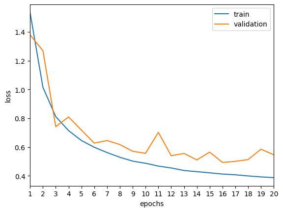

# MobileNet

An implementation of the MobileNet architecture, as described in the [paper](https://arxiv.org/pdf/1704.04861v1.pdf).  
The mobilenet architecture is based on depthwise separable convolutions. It involves a two step process:
  1. depthwise convolution
  2. pointwise convolution
  
Depthwise convolution uses a single filter for each input channel and the output is combined with a 1x1 convolution filter (pointwise convolution). It produces the same output shape as a standard convolution layer.  
Compared to the standard convolution, depthwise separable convolution has the effect of reducing computation and model size significantly.

The depthwise and pointwise convolution layers are each followed by a batchnormalization layer and a relu activation layer.
The full mobilenet architecture is shown in the image below.  

The implementation was tested on the [CIFAR-10 dataset](https://www.cs.toronto.edu/~kriz/cifar.html), which was upsampled from 32x32 to 224x224.  
After training for 20 epochs, using the Adam optimizer with a learning rate of 1e-2 and weight decay of 1e-5.
10% of the training data was used as a validation set. At the end of 20 epochs, the training and validation accuracies were about 86.70% and 81.98% respectively. 

 

The model was reloaded with the weights that had the lowest validation loss [epoch 16] and an overall accuracy of <b>83.47%</b> was achieved on the test set.  
The training and validation accuracies at epoch 16 was about 85.7% and 83.1% respectively.
